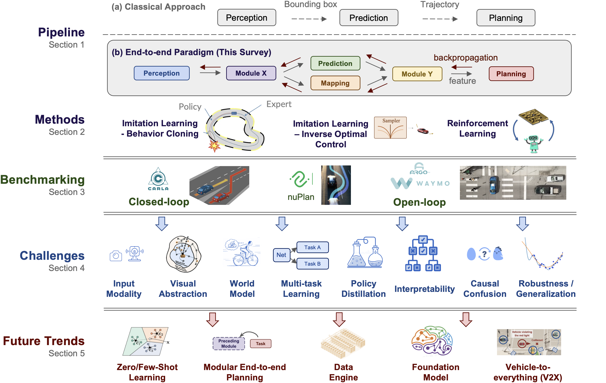

<div id="top">

# End-to-end Autonomous Driving

> **This repo is all you need for end-to-end autonomous driving research.** We present awesome talks, comprehensive paper collections, benchmarks, and challenges.

<!-- 
 -->

## Table of Contents

- [At a Glance](#at-a-glance)
- [Learning Materials for Beginners](#learning-materials-for-beginners)
- [Workshops and Talks](#workshops-and-talks)
- [Paper Collection](#paper-collection)
- [Benchmarks and Datasets](#benchmarks-and-datasets)
- [Competitions / Challenges](#competitions--challenges) 
- [Contributing](#contributing)
- [License](#license)
- [Citation](#citation)
- [Contact](#contact)

## At a Glance

The autonomous driving community has witnessed a rapid growth in approaches that embrace an end-to-end algorithm framework, utilizing raw sensor input to generate vehicle motion plans, instead of concentrating on individual tasks such as detection and motion prediction. In this survey, we provide a comprehensive analysis of more than 250 papers on the motivation, roadmap, methodology, challenges, and future trends in end-to-end autonomous driving. More details can be found in our survey paper.

> [**End-to-end Autonomous Driving: Challenges and Frontiers**](https://arxiv.org/abs/2306.16927)
>
> [Li Chen](https://scholar.google.com/citations?user=ulZxvY0AAAAJ&hl=en&authuser=1)<sup>1</sup>, [Penghao Wu](https://scholar.google.com/citations?user=9mssd5EAAAAJ&hl=en)<sup>1</sup>, [Kashyap Chitta](https://kashyap7x.github.io/)<sup>2,3</sup>, [Bernhard Jaeger](https://kait0.github.io/)<sup>2,3</sup>, [Andreas Geiger](https://www.cvlibs.net/)<sup>2,3</sup>, and [Hongyang Li](https://lihongyang.info/)<sup>1,4</sup>
> 
> <sup>1</sup> Shanghai AI Lab, <sup>2</sup> University of Tübingen, <sup>3</sup> Tübingen AI Center, <sup>4</sup> Shanghai Jiao Tong University
>

<br/>



<br/>

``
If you find some useful related materials, shoot us an email or simply open a PR!
``

<p align="right">(<a href="#top">back to top</a>)</p>


## Learning Materials for Beginners
  
**Online Courses**
- [Lecture: Self-Driving Cars](https://uni-tuebingen.de/en/fakultaeten/mathematisch-naturwissenschaftliche-fakultaet/fachbereiche/informatik/lehrstuehle/autonomous-vision/lectures/self-driving-cars/), Andreas Geiger, University of Tübingen, Germany
- [Self-Driving Cars Specialization](https://www.coursera.org/specializations/self-driving-cars), University of Toronto, Coursera
- [The Complete Self-Driving Car Course - Applied Deep Learning](https://www.udemy.com/course/applied-deep-learningtm-the-complete-self-driving-car-course/), Udemy
- [Self-Driving Car Engineer Nanodegree Program](https://www.udacity.com/course/self-driving-car-engineer-nanodegree--nd0013), Udacity

<details>
  <summary>Useful Tools</summary>
  
  - Under construction!
  
</details>

<p align="right">(<a href="#top">back to top</a>)</p>
  
## Workshops and Talks

**Workshops**
- [CVPR 2023] [Workshop on End-to-end Autonomous Driving](https://opendrivelab.com/e2ead/cvpr23.html)
- [CVPR 2023] [End-to-End Autonomous Driving: Perception, Prediction, Planning and Simulation](https://e2ead.github.io/2023.html)
- [ICRA 2023] [Scalable Autonomous Driving](https://sites.google.com/view/icra2023av/home?authuser=0)
- [NeurIPS 2022] [Machine Learning for Autonomous Driving](https://ml4ad.github.io/)
- [IROS 2022] [Behavior-driven Autonomous Driving in Unstructured Environments](https://gamma.umd.edu/workshops/badue22/)
- [ICRA 2022] [Fresh Perspectives on the Future of Autonomous Driving Workshop](https://www.self-driving-cars.org/)
- [NeurIPS 2021] [Machine Learning for Autonomous Driving](https://ml4ad.github.io/2021/)
- [NeurIPS 2020] [Machine Learning for Autonomous Driving](https://ml4ad.github.io/2020/)
- [CVPR 2020] [Workshop on Scalability in Autonomous Driving](https://sites.google.com/view/cvpr20-scalability)


<details>
  <summary>Relevant talks from other workshops</summary>
  
  - [Common Misconceptions in Autonomous Driving](https://www.youtube.com/watch?v=x_42Fji1Z2M) - Andreas Geiger, Workshop on Autonomous Driving, CVPR 2023
  - [Learning Robust Policies for Self-Driving](https://www.youtube.com/watch?v=rm-1sPQV4zg) - Andreas Geiger, AVVision: Autonomous Vehicle Vision Workshop, ECCV 2022
  - [Autonomous Driving: The Way Forward](https://www.youtube.com/watch?v=XmtTjqimW3g) -  Vladlen Koltun, Workshop on AI for Autonomous Driving, ICML 2020
  - [Feedback in Imitation Learning: Confusion on Causality and Covariate Shift](https://www.youtube.com/watch?v=4VAwdCIBTG8) -  Sanjiban Choudhury and Arun Venkatraman, Workshop on AI for Autonomous Driving, ICML 2020
  
</details>
  
<p align="right">(<a href="#top">back to top</a>)</p>

## Paper Collection
We list key challenges from a wide span of candidate concerns, as well as trending methodologies. Please refer to [this page](./papers.md) for the full list, and the [survey paper](https://arxiv.org/abs/2306.16927) for detailed discussions.

- [Survey](./papers.md#survey)
- [Multi-sensor Fusion](./papers.md#multi-sensor-fusion)
- [Language-guided Driving](./papers.md#language-guided-driving)
- [Multi-task Learning](./papers.md#multi-task-learning)
- [Interpretability](./papers.md#interpretability)
  - [Attention Visualization](./papers.md#attention-visualization)
  - [Interpretable Tasks](./papers.md#interpretable-tasks)
  - [Cost Learning](./papers.md#cost-learning)
  - [Linguistic Explainability](./papers.md#linguistic-explainability)
  - [Uncertainty Modeling](./papers.md#uncertainty-modeling)
- [Visual Abstraction / Representation Learning](./papers.md#visual-abstraction--representation-learning)
- [Policy Distillation](./papers.md#policy-distillation)
- [Causal Confusion](./papers.md#causal-confusion)
- [World Model & Model-based RL](./papers.md#world-model--model-based-rl)
- [Robustness](./papers.md#robustness)
  - [Long-tailed Distribution](./papers.md#long-tailed-distribution)
  - [Covariate Shift](./papers.md#covariate-shift)
  - [Domain Adaptation](./papers.md#domain-adaptation)
- [Affordance Learning](./papers.md#affordance-learning)
- [BEV](./papers.md#bev)
- [Transformer](./papers.md#transformer)
- [V2V Cooperative](./papers.md#v2v-cooperative)
- [Distributed RL](./papers.md#distributed-rl)
- [Data-driven Simulation](./papers.md#data-driven-simulation)
  - [Parameter Initialization](./papers.md#parameter-initialization)
  - [Traffic Simulation](./papers.md#traffic-simulation)
  - [Sensor Simulation](./papers.md#sensor-simulation)

<p align="right">(<a href="#top">back to top</a>)</p>

## Benchmarks and Datasets

**Closed-loop**
- [CARLA](https://leaderboard.carla.org/leaderboard/)
  - [Leaderboard 1.0](https://leaderboard.carla.org/get_started_v1/)
  - [Leaderboard 2.0](https://leaderboard.carla.org/get_started/)
- [nuPlan](https://www.nuscenes.org/nuplan)
  - [Leaderboard](https://eval.ai/web/challenges/challenge-page/1856/overview) (inactive after the CVPR 2023 challege)

<details>
  <summary>Open-loop</summary>
  
- [nuScenes](https://www.nuscenes.org/nuscenes)
- [nuPlan](https://www.nuscenes.org/nuplan)
- [Argoverse](https://www.argoverse.org/av2.html)
- [Waymo Open Dataset](https://waymo.com/open/)
  
</details>

<p align="right">(<a href="#top">back to top</a>)</p>

## Competitions / Challenges

- [nuPlan planning](https://opendrivelab.com/AD23Challenge.html#nuplan_planning), Workshop on End-to-end Autonomous Driving, CVPR 2023
- [CARLA Autonomous Driving Challenge 2022](https://ml4ad.github.io/#challenge), Machine Learning for Autonomous Driving, NeurIPS 2022
- [CARLA Autonomous Driving Challenge 2021](https://ml4ad.github.io/2021/#challenge), Machine Learning for Autonomous Driving, NeurIPS 2021
- [CARLA Autonomous Driving Challenge 2020](https://ml4ad.github.io/2020/#challenge), Machine Learning for Autonomous Driving, NeurIPS 2020
- [Learn-to-Race Autonomous Racing Virtual Challenge](https://www.aicrowd.com/challenges/learn-to-race-autonomous-racing-virtual-challenge), 2022
- [INDY Autonomous Challenge](https://www.indyautonomouschallenge.com/)

<p align="right">(<a href="#top">back to top</a>)</p>
  
## Contributing
Thank you for all your contributions. Please make sure to read the [contributing guide](./CONTRIBUTING.md) before you make a pull request.

<p align="right">(<a href="#top">back to top</a>)</p>

## License
End-to-end Autonomous Driving is released under the [MIT license](./LICENSE).

<p align="right">(<a href="#top">back to top</a>)</p>

## Citation
If you find this project useful in your research, please consider citing:
```BibTeX
@article{chen2023e2esurvey,
  title={End-to-end Autonomous Driving: Challenges and Frontiers},
  author={Chen, Li and Wu, Penghao and Chitta, Kashyap and Jaeger, Bernhard and Geiger, Andreas and Li, Hongyang},
  journal={arXiv},
  volume={2306.16927},
  year={2023}
}
```

<p align="right">(<a href="#top">back to top</a>)</p>

## Contact
Primary contact: `lihongyang@pjlab.org.cn`. You can also contact: `lichen@pjlab.org.cn`.

Join [Slack](https://join.slack.com/t/opendrivelab/shared_invite/zt-1rcp42b35-Wc5I0MhUrahlM5qDeJrVqQ) to chat with the commuty! Slack channel: `#e2ead`.

<p align="right">(<a href="#top">back to top</a>)</p>
